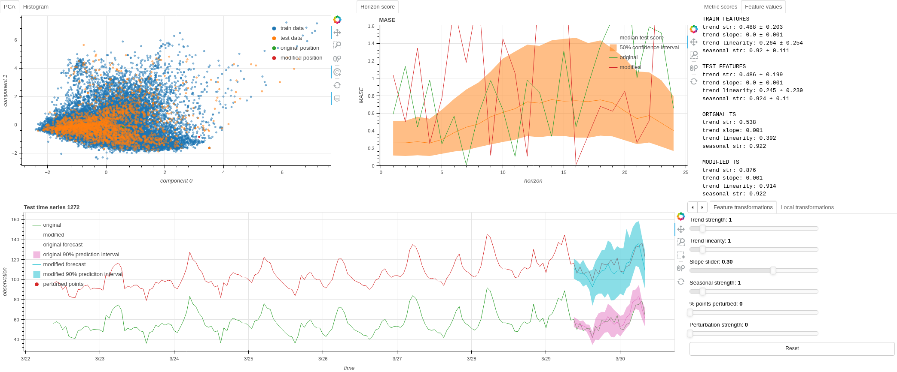

# EXPRTS: Exploring and Probing the Robustness of Time Series Forecasting Models



 of the time series; the last row shows the resulting time series when applying multiple different transformations to multiple different intervals of the time series.")

This repository contains the code for the paper [EXPRTS: Exploring and Probing the Robustness of Time Series Forecasting Models](https://arxiv.org/abs/2403.03508). We present a framework for transforming time series data and a visual analytics tool called EXPRTS, that allows users to explore the robustness of time series forecasting models. The framework supports a variety of transformations, including simple noise addition, scaling, and shifting, and more advanced transformations that modifies specific time series characteristics.

## Setup
To run the application start by installing and activating the environment:

```shell
conda env create -f environment.yaml
conda activate EXPRTS
```

We have uploadedthe necessary files to run an example with a dense network on the electricity dataset. Use the following command to run the example:

```shell
bokeh serve src/ --args experiments/electricity_nips/feedforward_prob/config.yaml
```


## Running the application for new datasets and/or models
To run the application with a new model and/or dataset, create a config.yaml file in `experiments/<dataset>/<model>`. Then the model can be trained by running

```shell
python scripts/fit.py <config_path>
```

During training, the script saves batches of training data to ``data/<dataset>/training_data`. We can calculate features from this data like this:

```shell
python scripts/calculate_features.py <config_path>
```

To calculate the features for predefined test data from GluonTS use the optional `--test-data` argument:

```shell
python scripts/calculate_features.py <config_path> --test-data=1
```

Evaluating models can be done like this:

```shell
python scripts/evaluate.py <config_path>
```

Once all of the above steps have been completed for the new dataset and/or model, the application can be started by running

```shell
bokeh serve src/ --args experiments/<dataset>/<model>/config.yaml
```

# Cite
You can cite our work using the following BibTeX entry:

```bibtex
@misc{kjaernli2025exprts,
      title={EXPRTS: Exploring and Probing the Robustness of Time Series Forecasting Models}, 
      author={Håkon Hanisch Kjærnli and Lluis Mas-Ribas and Hans Jakob Håland and Vegard Sjåvik and Aida Ashrafi and Helge Langseth and Odd Erik Gundersen},
      year={2025},
      journal={arXiv preprint arxiv:2403.03508}
}
```